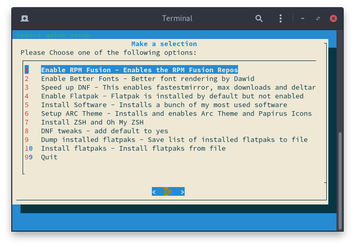

# Fedora-Setup
Description: Post install setup script for Fedora Linux

This script is written in Bash and utilises dialog for a friendlier menu system.

Forked from: [osiris2600/fedora-setup](https://github.com/osiris2600/fedora-setup)

